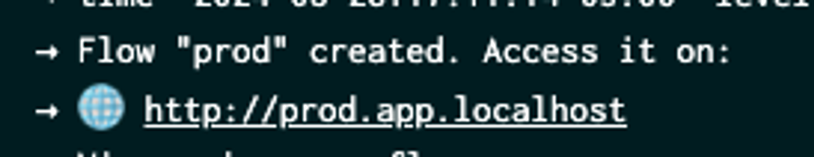
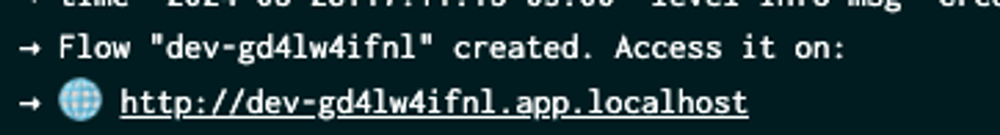

[](https://hub.docker.com/u/kurtosistech)

# Kardinal

## Disclaimer: This project is no longer maintained

## What is Kardinal?

Kardinal is an open-source framework for creating extremely lightweight ephemeral development environments within a shared Kubernetes cluster. Between dev environments, Kardinal shares every microservice or database that can be feasibly be shared, optimizing for cloud costs and fast spin-up/tear-down. To see how much you would save using Kardinal for your particular architecture, check out the [cost saving calculator](https://kardinal.dev/calculator).

In Kardinal, an environment is called a "[flow](https://kardinal.dev/docs/concepts/flows)" because it represents a path that a request takes through the cluster. Versions of services that are under development are deployed on-demand, and then shared across all development work that depends on that version. Read more about Kardinal in our [docs](https://kardinal.dev/docs).

### Why choose Kardinal?

- **Ephemeral Environments**: Spin up a new environment exactly when you need it, and just as quickly spin it down when you’re done.
- **Minimal Resource Usage**: Only deploy the services you’re actively working on. Kardinal takes care of the rest, so you don’t waste resources.
- **Flexible Environment Types**: Whether you need to test a single service or an entire application, Kardinal has you covered:
  - Single-Service Flows: Perfect for when you’re tweaking just one service.
  - Multi-Service Flows: Ideal for when your feature involves multiple services.
  - State-Isolated Flows: Great for features that need their own isolated databases or caches.
  - Full Application Flows: For those times when you need end-to-end testing with full isolation.
- **Cost Savings**: Kardinal can help you save big by avoiding unnecessary resource duplication. It’s a game-changer for teams looking to cut costs. Check out [this calculator](https://kardinal.dev/calculator) to run your own calculations.
- **Open Source**: Kardinal is open source, so use it however fits best within your workflows

### Want a demo?

Sign-up for a free demo of Kardinal below 👇

[](https://calendly.com/d/cqhd-tgj-vmc/45-minute-meeting?month=2024-09)

## Installation

### **Step 1: Install Kardinal**

To install Kardinal, run the following command:

```
curl get.kardinal.dev -sL | sh
```

### **Step 2: Set up a development Kubernetes cluster**

All you need is a Kubernetes cluster with Istio enabled, and kubectl installed on your machine, pointing to your cluster. If you need help with this, read more [here](https://kardinal.dev/docs/getting-started/install)

### **Step 3: Deploy the Kardinal Manager to your cluster**

Make sure that kubectl is pointing to your cluster, and then run the following command:

```
kardinal manager deploy kloud-kardinal-kontrol
```

Once installed check out our docs on [creating your first flow](https://kardinal.dev/docs/getting-started/own-app).

## Try it out in a Playground

We have a playground that runs in Github Codespaces so you can try Kardinal right now without installing anything. Click below to open a Codespace with the playground. The default settings for the Codespace will work just fine.

[](https://github.com/codespaces/new?hide_repo_select=true&ref=main&repo=818205437&skip_quickstart=true&machine=standardLinux32gb&devcontainer_path=.devcontainer%2Fdevcontainer.json)

> [!WARNING]
> Please keep in mind that Kardinal is still under active development
> and therefore full backward compatibility is not guaranteed before reaching v1.0.0.

## Quick start with a demo application

### Step 1: Deploy the demo app

Once you have Kardinal installed, you can run through the following demo. For step 1, since this guide is using minikube, you'll need to set up the minikube tunnel to access the frontend of the application you're about to deploy:

```bash
minikube tunnel
```

You can leave the tunnel running. In a new terminal window, deploy the demo app via Kardinal:

```bash
curl https://raw.githubusercontent.com/kurtosis-tech/new-obd/main/release/obd-kardinal.yaml > ./obd-kardinal.yaml
kardinal deploy -k ./obd-kardinal.yaml
```

You can view the frontend of the demo app by going to:

`http://baseline.app.localhost`

Feel free to click around, add items to your cart, and shop!

The Kardinal dashboard will show the architecture of your application, along with any logical environments (flows) you create on top of it. To view the dashboard, run:

```bash
kardinal dashboard
```

and click on the "Traffic configuration" sidebar item.

### Step 2: Create a lightweight development environment (dev flow)

Create a new flow by specifying a service name and a container image.

Here is an example of creating a dev flow for the frontend service, using an image we've prepared for this demo:

```bash
kardinal flow create frontend kurtosistech/frontend:demo-frontend
```

This command will output a URL that you can use to access the frontend of the development environment. You can view the frontend of the application by going to the URL provided.

Notice that there are already items in your cart in the development environment. We've configured the development "flow" in this demo to run with it's own database which is seeded with test data. This demonstrates how dev flows can be configured with the data that the development team needs to do their testing work.

To inspect the resources in your cluster, and see how Kardinal is reusing resources in your stable environment in the dev environment, go to the dashboard again:

```bash
kardinal dashboard
```

and click on the "Traffic configuration" sidebar item.

### Step 3: Clean up your development flow

When you're done with your development flow, you can delete it by running:

```bash
kardinal flow delete <flow_id>
```

The flow_id is in the output of the kardinal flow create command, but if you've lost it, you can get it again by running:

```bash
kardinal flow ls
```

Once you've deleted the flow, you can verify that the resources have been cleaned up by going to the dashboard again.

## Develop with Kardinal + Tilt

<details>
<summary>Expand to see how to Develop with Kardinal + Tilt</summary>

Is it possible to develop your app with Kardinal + [Tilt](https://tilt.dev/). Here’s how to do it::

### Prerequisites:

- [Kardinal CLI](https://github.com/kurtosis-tech/kardinal?tab=readme-ov-file#installation)
- [Tilt](https://docs.tilt.dev/install.html)
- Local K8s cluster, it could be [Minikube](https://minikube.sigs.k8s.io/docs/start) or [Docker desktop](https://docs.docker.com/desktop/kubernetes/) for instance
- [Istio](https://istio.io/latest/docs/setup/install/istioctl/#install-istio-using-the-default-profile)
- Gateway API
  - ```bash
    kubectl kustomize "github.com/kubernetes-sigs/gateway-api/config/crd?ref=v1.1.0" | kubectl apply -f -;
    ```

### Deploy your application:

#### Option 1 - Use Tilt with existing Kardinal deployment

Assuming you’ve already deployed your application’s manifest using the `kardinal deploy` command, your cluster topology is prepared for deployment with Tilt. Check the following example to learn how to do it:

Example:

1. Create this `Tiltfile`
```python
kardinal_topology_yaml = local(['kardinal', 'topology', 'print-manifest', '--add-trace-router'], quiet=True)
kardinal_topology_yaml_str = str(kardinal_topology_yaml)

if kardinal_topology_yaml_str != '':
    k8s_yaml(kardinal_topology_yaml, allow_duplicates = True)

local_resource(
    name='ingress-gateway-port-forward',
    serve_cmd=['kubectl', 'port-forward', 'service/istio-ingressgateway', '80:80', '-n', 'istio-system']
)
```
2. Run `sudo tilt up`

The first `local` call retrieves the cluster topology from Kardinal Kontrol using the `kardinal topology` command. This command prints a multi-resource manifest that Tilt captures and then applies with the `k8s_yaml` command.  
Finally, the `local_resource` function executes the port forwarding command, allowing the Ingress Gateway to handle browser requests on the default port 80. This command requires `sudo` privileges because it binds to the default port 80.

#### Option 2 - Using Tilt without existing Kardinal deployment

You can also include the `kardinal deploy` command inside the Tilt to handle all the deployment flow directly with the `tilt up` command.

Example:

1. Create a `Tiltfile` like this, replacing the placeholder data with your own.
```python
local(['kardinal', 'deploy', '-k', '{your-kardinal-manifest-yaml-filepath}'])

kardinal_topology_yaml = local(['kardinal', 'topology', 'print-manifest', '--add-trace-router'], quiet=True)
kardinal_topology_yaml_str = str(kardinal_topology_yaml)

if kardinal_topology_yaml_str != '':
    k8s_yaml(kardinal_topology_yaml, allow_duplicates = True)

local_resource(
    name='ingress-gateway-port-forward',
    serve_cmd=['kubectl', 'port-forward', 'service/istio-ingressgateway', '80:80', '-n', 'istio-system']
)
```
2. Run `sudo tilt up`

In this example, the `kardinal deploy` command is used at the start to deploy the multi-resource manifest file to Kardinal Kontrol.

### Build and Deploy your application:

You can also integrate Kardinal with Tilt to build your app’s containers and set up development workflows that automatically reflect changes whenever you save your files.

Example:

1. Create a `Tiltfile` like this, replacing the placeholder data with your own.

```python
local(['kardinal', 'deploy', '-k', '{your-kardinal-manifest-yaml-filepath}'])

local(['kardinal', 'flow', 'create', '{service}', '{service-dev-image}'])

docker_build(
	'{service-dev-image}',
	context='{./src/}',
	dockerfile='{./src/Dockerfile}',
)

kardinal_topology_yaml = local(['kardinal', 'topology', 'print-manifest', '--add-trace-router'], quiet=True)
kardinal_topology_yaml_str = str(kardinal_topology_yaml)

if kardinal_topology_yaml_str != '':
    k8s_yaml(kardinal_topology_yaml, allow_duplicates = True)

local_resource(
    name='ingress-gateway-port-forward',
    serve_cmd=['kubectl', 'port-forward', 'service/istio-ingressgateway', '80:80', '-n', 'istio-system']
)
```

2. Run `sudo tilt up`

This example introduces two new elements: first, the `kardinal flow` local execution to create the development flow post-deployment. Note the image name `service-dev-image`, as it will be used in the second element.
The second element is the `docker build` function call, where, we use `service-dev-image` as the first argument. This creates a link, between the container being built and the service in the development flow. Consequently, any changes to files within the specified context (the second argument) will trigger Tilt's hot reload mechanism, updating the Kardinal development flow.
Note that in this example we are building the service’s container with the `docker_build` instruction but you can also use another build way as the [custom image builders](https://docs.tilt.dev/custom_build.html)

### Access into the PROD and DEV flows:

The `prod` and `dev` application URLs are printed on the logs screen of the Tiltfile execution, you can click on their links to access both flows in the browser.





### Cleanup:

After completing the development cycle, you can remove all created resources from the cluster by running the following command:

`tilt down --delete-namespaces`

The `delete-namespaces` flag is used to remove the application’s namespace, it won’t delete the `default` namespace

### More configuration examples:

For additional examples of configuring Kardinal with Tilt, refer to the [Tiltfile in the Kardinal Boutique demo app](https://github.com/kurtosis-tech/new-obd/blob/main/Tiltfile).

</details>

## Develop with Kardinal + Telepresence

<details>
<summary>Expand to see how to Develop with Kardinal + Telepresence</summary>

Is it possible to use [Telepresence](https://tilt.dev/) in a Kardinal dev flow. Here’s how to do it:

### Prerequisites:

- [Kardinal CLI](https://github.com/kurtosis-tech/kardinal?tab=readme-ov-file#installation)
- [Telepresence](https://www.getambassador.io/docs/telepresence-oss/latest/install)
- Local K8s cluster, it could be [Minikube](https://minikube.sigs.k8s.io/docs/start) or [Docker desktop](https://docs.docker.com/desktop/kubernetes/) for instance
- [Istio](https://istio.io/latest/docs/setup/install/istioctl/#install-istio-using-the-default-profile)
- [kubectl](https://kubernetes.io/docs/tasks/tools/#kubectl)

### Intercept your service in a Kardinal dev flow:

Assuming you’ve already deployed your application’s manifest using the `kardinal deploy` command, your cluster topology is prepared for creating dev flows. Check the following example to learn how to do it:

Example:

1. Install Telepresence manager with Istio integration in your cluster (make sure that you have selected the targe cluster with kubectl before running it) 
```shell
telepresence helm install --set trafficManager.serviceMesh.type=istio
```
2. Create a dev flow with `Kardinal`.
```shell
kardinal flow create frontend kurtosistech/frontend:demo-on-sale
```
3. Take note of the flow ID created
4. Start the `frontend` app locally in a local port either with the terminal or your IDE, you can even start it in debug mode.
5. Take note the `port` where it's running because it will be used later
6. Run the Kardinal flow `telepresence-intercept` command to intercept the traffic (replace the values between the brackets)
```shell
kardinal flow telepresence-intercept {{flow-id}} {{service-name}} {{local-port}}
```
7. Navigate the website in the browser to receive the request in the app running locally outside the cluster

</details>

## Helpful links

- Explore our [docs](https://kardinal.dev/docs) to learn more about how Kardinal works.
- Ask questions and get help in our community [forum](https://discuss.kardinal.dev).
- Read our [blog](https://blog.kardinal.dev/) for tips from developers and creators.

